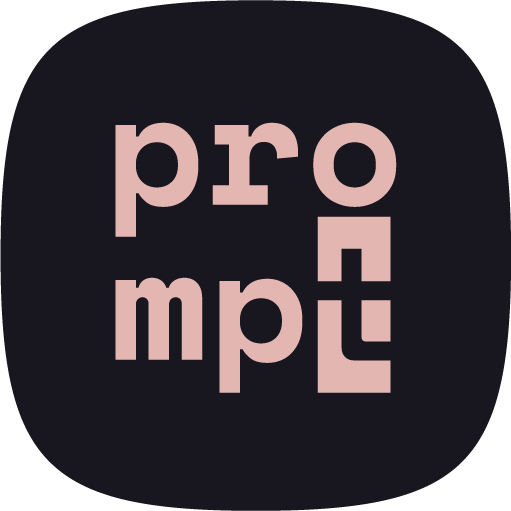

<p align="center">

</p>

# Prompt

A comprehensive Swift library for building beautiful and interactive command-line interfaces.

## Features

- **Rich Terminal UI Components**: Spinners, progress indicators, tables, boxes, and panels
- **Interactive Prompts**: Multi-select menus with arrow key navigation, confirmations, and text inputs
- **Colored Output**: Status indicators with automatic color support detection
- **Hierarchical Display**: Nested items, sections, and formatted output
- **Log Levels**: Control output verbosity (quiet, normal, verbose)
- **Path Formatting**: Syntax highlighting for file paths
- **Error Formatting**: Contextual error messages with helpful suggestions

## Installation

### Swift Package Manager

Add Prompt to your `Package.swift`:

```swift
dependencies: [
    .package(url: "https://github.com/yourusername/Prompt.git", from: "1.0.0")
]
```

Then add it to your target:

```swift
.target(
    name: "YourTarget",
    dependencies: [
        .product(name: "Prompt", package: "Prompt")
    ]
)
```

### Import & Setup

Once the dependency is resolved run-time, import the module and configure the service wherever you orchestrate CLI output:

```swift
import Prompt

let prompt = PromptService(
    useColors: true,          // Automatically detects TTY support when omitted
    logLevel: .normal         // .quiet, .normal, .verbose
)
```

Store a single `PromptService` per command if you want consistent log levels and color preferences.

## Usage

```swift
import Prompt

let prompt = PromptService()

prompt.header("Release Wizard")
let name = prompt.prompt("App name", default: "Prompt")
let description = prompt.multiline("Release notes", placeholder: "Bug fixes and improvements")

let platforms = ["iOS", "macOS", "tvOS"]
let platform = prompt.select(
    "Target platform",
    options: platforms
)

let storeOptions = ["TestFlight", "App Store", "Enterprise"]
let enabledStores = prompt.multiSelect(
    "Ship to stores",
    options: storeOptions,
    defaults: [true, true, false],
    minSelections: 1
)

let dryRun = prompt.radioSelect(
    "Run as dry run?",
    options: ["No", "Yes"]
)

prompt.withSpinner("Bundling assets") {
    // long-running work
}

if dryRun == 1 {
    prompt.warning("Dry run enabled")
}

prompt.success("Ready to deploy \(name) for \(platforms[platform]) (\(description.count) chars)")

prompt.table(
    headers: ["Runtime", "Enabled"],
    rows: storeOptions.enumerated().map { (index, name) in
        [name, enabledStores.contains(index) ? "✓" : " "]
    }
)

prompt.summary("Deploy when QA signs off")
```

## API Overview

Prompt ships opinionated building blocks for input, selection, layout, and progress reporting. Elements are grouped below with usage examples so you can copy/paste directly into your CLIs.

### Input Prompts

- `prompt(_:, default:)` – single-line string input with optional default.
- `confirm(_:, default:)` – yes/no confirmation (`Y/n` hint updates automatically).
- `multiline(_:, placeholder:)` – launches the built-in `MultiLineEditor` that supports bracketed paste and editing.

```swift
let project = prompt.prompt("Project name")
let confirmed = prompt.confirm("Push to prod?", default: false)
let body = prompt.multiline("Commit message", placeholder: "Describe changes...")
```

### Selection Elements

- `select(_:, options:, default:)` – number-based single selection.
- `multiSelect(_:, options:, defaults:, minSelections:, disabled:)` – arrow-key selector with validation.
- `radioSelect(_:, options:, includeNone:, noneCaption:)` – arrow-key selector returning an optional index for single-choice lists.

```swift
let branch = prompt.select("Release branch", options: ["main", "release"], default: 1)
let selectedStores = prompt.multiSelect(
    "Targets",
    options: ["App Store", "TestFlight", "Enterprise"],
    defaults: [true, true, false],
    minSelections: 1,
    disabled: [false, false, true]
)
let mode = prompt.radioSelect("Mode", options: ["Full deploy", "Dry run"], includeNone: false)
```

### Spinners & Progress

- `spinner(_:)` – manual control over lifecycle.
- `withSpinner(_:, task:)` – wraps a throwing closure and stops automatically.
- `startOperation(_:)` / `completeOperation(_:, duration:)` – textual progress steps.

```swift
let spinner = prompt.spinner("Linking binaries")
spinner.start()
// ... run a task ...
spinner.stop(success: true)

prompt.withSpinner("Publishing artifacts") {
    try runReleaseBuild()
}

prompt.startOperation("Uploading build")
prompt.completeOperation("Upload finished", duration: 3.2)
```

### Messaging & Hierarchy

- `info`, `success`, `warning`, `error`, `verbose` – color-coded status lines.
- `item`, `itemSuccess`, `itemError`, `itemWarning`, `itemSkipped` – nested bullet lists with indentation control.
- `header`, `section`, `divider`, `step` – structure multi-step flows.

```swift
prompt.header("Verification")
prompt.item("Linting", indent: 1)
prompt.itemSuccess("SwiftLint passed")
prompt.itemWarning("Docs outdated", indent: 1)
prompt.step(2, "Run tests")
prompt.success("Green build")
```

### Layout & Structured Output

- `box(_:, style:, title:)` – draw framed blocks in `.single`, `.double`, or `.rounded` styles.
- `panel(_:, items:)` – two-column summaries (key/value pairs).
- `table(headers:, rows:, style:)` – multi-row data tables using the `Table` helper.
- `summary(_:)` / `nextSteps(_:)` – highlight conclusions or follow-up work.

```swift
prompt.box(
    """
    Prompt CLI
    Version 1.0.0
    """,
    style: .rounded,
    title: "About"
)

prompt.panel("Build Metadata", items: [
    ("Branch", "main"),
    ("SHA", "9bf2d95")
])

prompt.table(
    headers: ["Step", "Status"],
    rows: [
        ["Lint", "✓"],
        ["Test", "✓"]
    ],
    style: .double
)

prompt.nextSteps(["Deploy to staging", "Notify QA"])
```

### Formatting Helpers

- `path(_:)` – colorize and shorten file paths for TTYs.
- `formatError(_:, context:)` – render `Swift.Error` values with context.
- `newline()` / `output(_:)` – low-level helpers when integrating with other loggers.

```swift
let prettyPath = prompt.path("~/Work/Prompt/Sources")
print("Building \(prettyPath)")

do {
    try performDeploy()
} catch {
    print(prompt.formatError(error, context: "deploy"))
}
```

## Requirements

- Swift 5.9+
- macOS 13.0+

## Dependencies

- [Rainbow](https://github.com/onevcat/Rainbow) - Terminal string styling with ANSI colors

## License

MIT License - See LICENSE file for details
